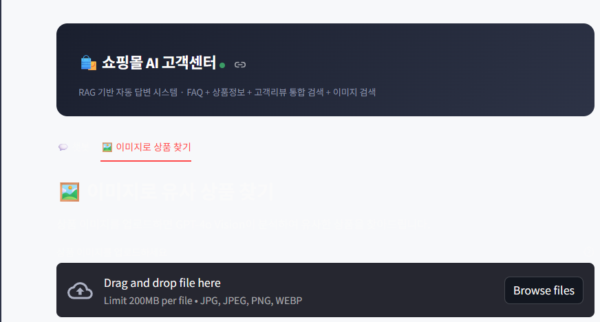
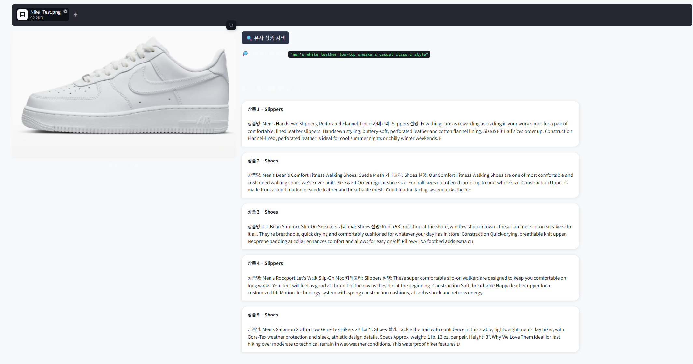
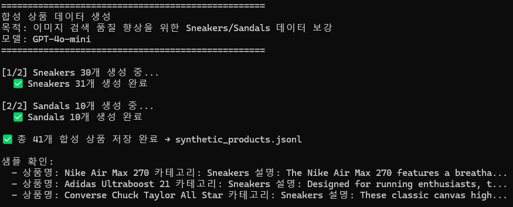
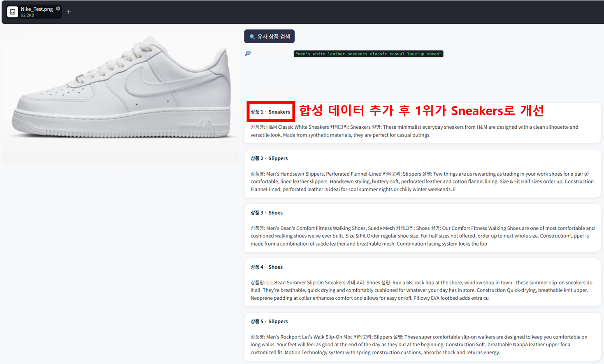
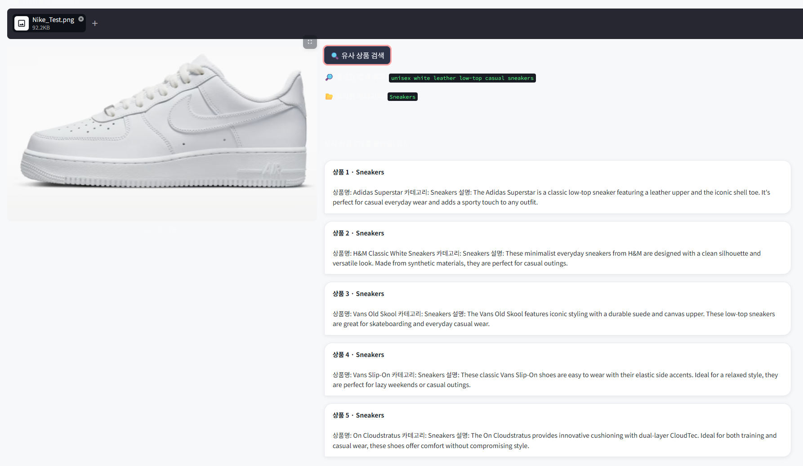
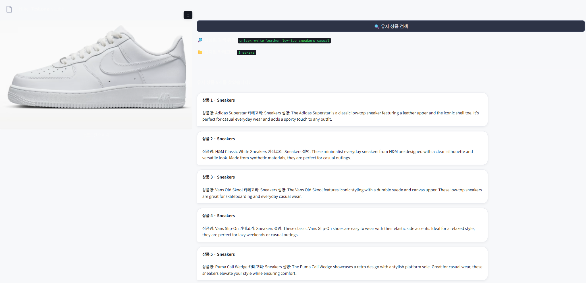

# 쇼핑몰 RAG 챗봇 v3 — 멀티모달

> 이미지 기반 유사 상품 검색 + GPT-4o Vision + Cohere Re-ranking


🚀 **라이브 데모**: [https://shopping-rag-v3-ndnwefdv24yp6vsfqxnmzq.streamlit.app](https://shopping-rag-v3-ndnwefdv24yp6vsfqxnmzq.streamlit.app)

> v1 (기본 RAG): [shopping-faq-rag](https://github.com/HyeonBin0118/shopping-faq-rag) · v2 (Re-ranking + 번역): [shopping-rag-v2](https://github.com/HyeonBin0118/shopping-rag-v2)

---

## v2와의 차이점

| 항목 | v2 | v3 |
|---|---|---|
| 검색 방식 | 텍스트 질문 → 검색 | **이미지 업로드 → 검색** |
| Vision 모델 | ❌ | ✅ GPT-4o Vision |
| 카테고리 필터링 | 텍스트 키워드 기반 | **이미지 분석 기반 자동 감지** |
| 데이터 | 원본 248개 | **합성 데이터 추가 (Sneakers 30개, Sandals 10개)** |
| UI | 단일 챗봇 화면 | **챗봇 탭 + 이미지 검색 탭** |

---

## 프로젝트 개요



v2 챗봇에 이미지 기반 유사 상품 검색 기능을 추가했습니다. 사용자가 상품 이미지를 업로드하면 GPT-4o Vision이 이미지를 분석하고, 카테고리 필터링 + Cohere Re-ranking으로 유사 상품을 찾아줍니다.

---

## 기술 스택

| 분류 | 기술 |
|---|---|
| 언어 | Python 3.11 |
| Vision | GPT-4o (이미지 → 쿼리 + 카테고리 생성) |
| 임베딩 | `text-embedding-3-small` (OpenAI) |
| 벡터 DB | ChromaDB |
| LLM | GPT-4o-mini |
| Re-ranking | Cohere Rerank v3.5 |
| RAG 프레임워크 | LangChain |
| UI | Streamlit |

---

## 프로젝트 구조

```
shopping-rag-v3/
├── step4_streamlit_app.py       # 챗봇 탭 + 이미지 검색 탭
├── multimodal_search.py         # GPT-4o Vision 분석 + 카테고리 필터링 + Re-ranking
├── generate_synthetic_products.py  # GPT-4o-mini 합성 데이터 생성
├── combine_chunks.py            # 원본 + 합성 데이터 병합
├── step2_embedding.py           # OpenAI 임베딩 + ChromaDB 구축
├── chunks_combined.jsonl        # 원본 + 합성 데이터 통합 (2,123개)
├── images/                      # 포트폴리오 스크린샷
└── requirements.txt
```

---

## 개발 과정

### 1. 이미지 검색 파이프라인 구현

```
이미지 업로드
    ↓
GPT-4o Vision (이미지 분석)
    ↓
쿼리 + 카테고리 생성
    ↓
카테고리 필터링 (ChromaDB 검색)
    ↓
Cohere Re-ranking
    ↓
유사 상품 반환
```

**GPT-4o Vision 프롬프트 설계**

이미지에서 단순히 텍스트 설명만 추출하는 것이 아니라, 검색에 바로 사용할 수 있는 **쿼리와 카테고리를 동시에 반환**하도록 설계했습니다.

```python
# GPT-4o에 쿼리 + 카테고리 동시 요청
response = client.chat.completions.create(
    model="gpt-4o",
    messages=[{
        "role": "user",
        "content": [
            {"type": "text", "text": """Return JSON with:
1. "query": concise search query in English (10-20 words)
2. "category": most specific category from [Sneakers, Shoes, Boots, Sandals, ...]
Respond ONLY with valid JSON."""},
            {"type": "image_url", "image_url": {"url": f"data:image/jpeg;base64,{base64_image}"}}
        ]
    }]
)
```

---

### 2. 데이터 부족 문제 발견 및 합성 데이터 생성

**문제 발견 과정**

멀티모달 검색 구현 후 나이키 에어포스 이미지로 테스트한 결과, 상품 데이터에 **Sneakers 카테고리가 전무**하여 슬리퍼·하이킹화가 검색되는 문제를 발견했습니다. 실제 서비스 환경에서는 데이터 불균형이 검색 품질에 직접 영향을 미친다는 점을 직접 경험한 케이스입니다.

```
카테고리 분포 분석:
Shoes: 23개, Boots: 18개, Slippers: 5개
Sneakers: 0개  ← 문제 발견!
```



*합성 데이터 추가 전 — 나이키 에어포스 이미지 검색 시 Slippers가 1위*

**해결: GPT-4o-mini 합성 데이터 생성**

```python
# generate_synthetic_products.py
response = client.chat.completions.create(
    model="gpt-4o-mini",
    messages=[{
        "role": "system",
        "content": "You are a product data generator..."
    }, {
        "role": "user",
        "content": f"Generate {count} realistic {category} products..."
    }]
)
```



Sneakers 30개, Sandals 10개 생성 → 기존 2,082개 + 41개 = **2,123개 통합**



*합성 데이터 추가 후 — 1위가 Sneakers로 개선*

---

### 3. 카테고리 필터링 + Re-ranking 적용

합성 데이터 추가 후에도 2~5위에 Slippers가 남아있는 문제를 카테고리 필터링과 Re-ranking으로 추가 개선했습니다.

**카테고리 필터링**

GPT-4o가 판단한 카테고리와 관련 없는 상품은 검색 대상에서 제외합니다.

```python
CATEGORY_MAP = {
    "Sneakers": ["Sneakers", "Shoes"],
    "Boots":    ["Boots", "Shoes"],
    "Sandals":  ["Sandals", "Shoes"],
    ...
}

# 카테고리에 해당하는 상품만 필터링
allowed_categories = CATEGORY_MAP.get(category, [category, "Shoes"])
filtered = [d for d in all_docs if d.metadata.get("category") in allowed_categories]
```

**Cohere Re-ranking**

```python
response = co.rerank(
    model="rerank-v3.5",
    query=query,
    documents=[d.page_content for d in filtered_docs],
    top_n=5,
)
```

**최종 결과:**



| 단계 | 상품 1 | 상품 2~5 |
|---|---|---|
| 초기 (합성 데이터 없음) | Slippers ❌ | Slippers, Hiking Boots ❌ |
| 합성 데이터 추가 후 | Sneakers ✅ | 일부 Slippers ⚠️ |
| 카테고리 필터링 + Re-ranking | **Sneakers** ✅ | **전부 Sneakers** ✅ |

---

## 배포 결과



*Streamlit Cloud 배포 — localhost에서 실제 배포 URL로*

---

## 설치 및 실행

```bash
# 1. 환경 설정
conda create -n rag_env python=3.11
conda activate rag_env
pip install -r requirements.txt

# 2. API 키 설정
set OPENAI_API_KEY=sk-...
set COHERE_API_KEY=...

# 3. (선택) 합성 데이터 생성
python generate_synthetic_products.py
python combine_chunks.py

# 4. 임베딩 구축
python step2_embedding.py

# 5. Streamlit 실행
streamlit run step4_streamlit_app.py
```

---

## API 사용 비용

| 항목 | 비용 |
|---|---|
| 합성 데이터 생성 40개 (gpt-4o-mini) | ~$0.005 |
| 재임베딩 2,123개 (text-embedding-3-small) | ~$0.004 |
| 이미지 분석 테스트 (gpt-4o) | ~$0.01 |
| **합계** | **~$0.019 (약 28원)** |

---

## 개발 인사이트

- 데이터 불균형은 아무리 좋은 검색 알고리즘을 써도 결과 품질을 떨어뜨린다 — 실제 테스트에서 직접 발견하고 합성 데이터로 해결
- GPT-4o Vision은 단순 이미지 설명을 넘어 검색 쿼리와 카테고리를 동시에 추출하는 용도로 활용 가능
- 카테고리 필터링 + Re-ranking 조합이 단순 벡터 검색 대비 상위 5개 결과의 정확도를 크게 향상시킴

---

## 참고 자료

- [LangChain 공식 문서](https://docs.langchain.com)
- [ChromaDB 공식 문서](https://docs.trychroma.com)
- [Cohere Rerank 문서](https://docs.cohere.com/docs/rerank)
- [OpenAI Vision 문서](https://platform.openai.com/docs/guides/vision)
- v1: [shopping-faq-rag](https://github.com/HyeonBin0118/shopping-faq-rag)
- v2: [shopping-rag-v2](https://github.com/HyeonBin0118/shopping-rag-v2)
